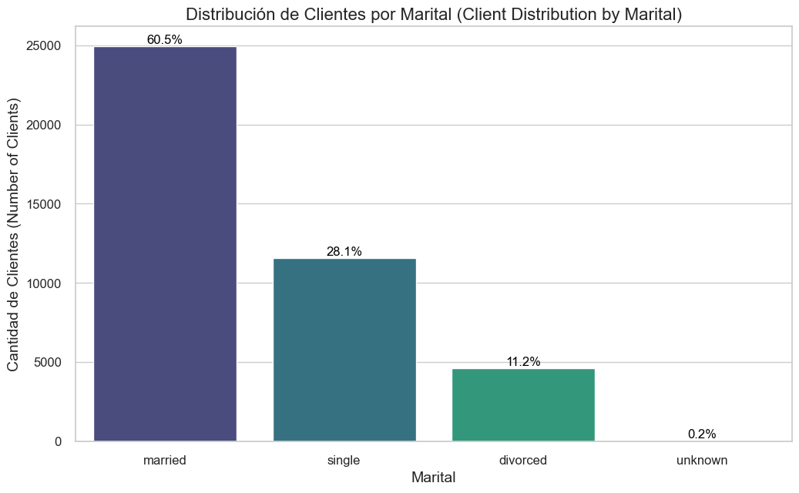
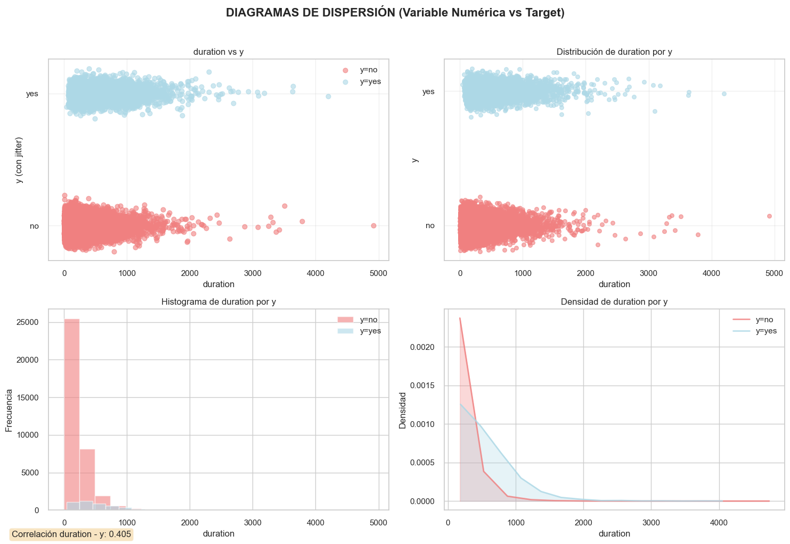
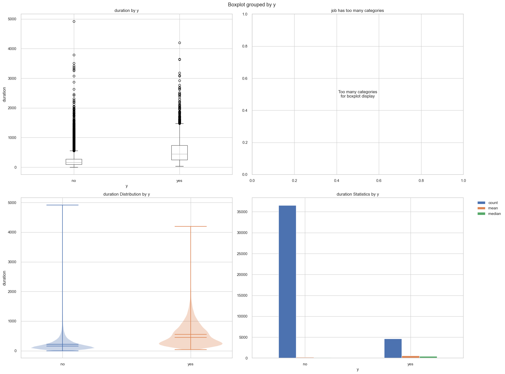
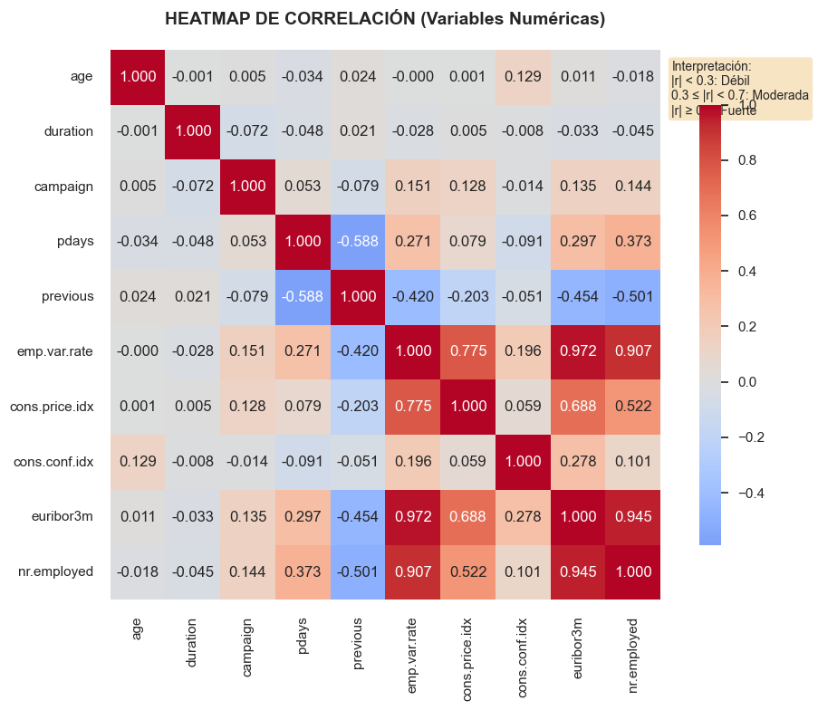
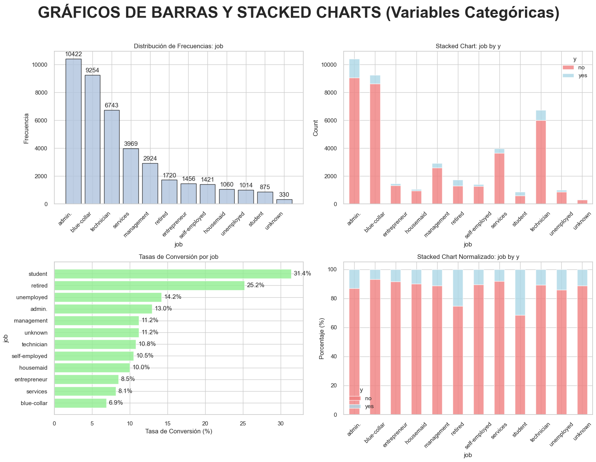
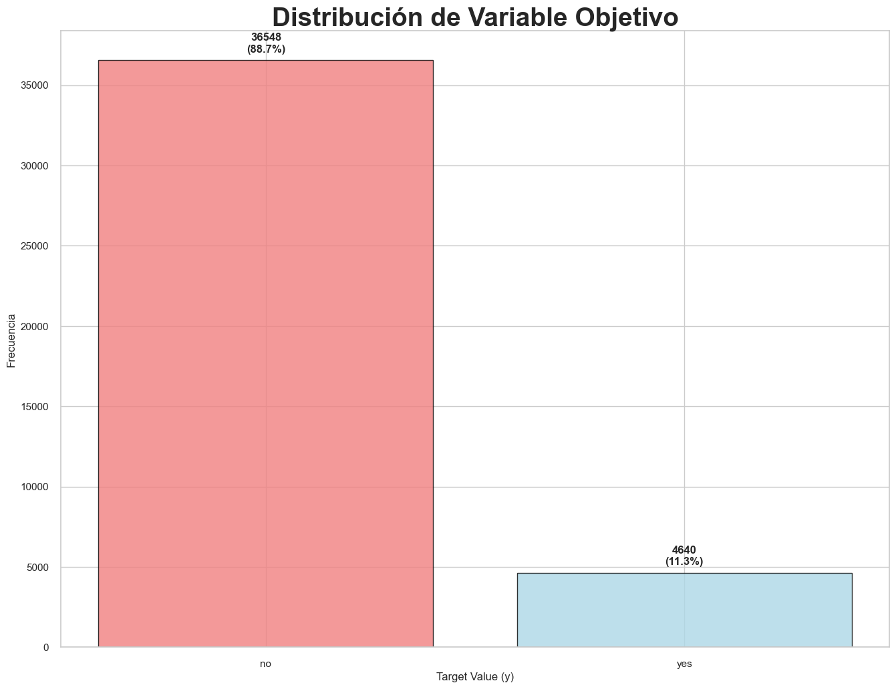

# Bank Marketing Dataset - Data Dictionary

## Dataset Information

**Title:** Bank Marketing (with social/economic context)

**Source:** UCI Machine Learning Repository
**Created by:** Sérgio Moro (ISCTE-IUL), Paulo Cortez (Univ. Minho) and Paulo Rita (ISCTE-IUL) @ 2014

### Citation
If you use this dataset, please include the following citation:

> [Moro et al., 2014] S. Moro, P. Cortez and P. Rita. A Data-Driven Approach to Predict the Success of Bank Telemarketing. Decision Support Systems, In press, http://dx.doi.org/10.1016/j.dss.2014.03.001

## Dataset Overview

- **Number of Instances:** 41,188 (bank-additional-full.csv)
- **Number of Features:** 20 input variables + 1 output variable
- **Time Period:** May 2008 to November 2010
- **Target Variable:** Binary classification - predict if the client will subscribe a bank term deposit

## Feature Descriptions

### Bank Client Data

| Variable | Type | Description | Values |
|----------|------|-------------|---------|
| `age` | Numeric | Age of the client | Integer values |
| `job` | Categorical | Type of job | "admin.", "blue-collar", "entrepreneur", "housemaid", "management", "retired", "self-employed", "services", "student", "technician", "unemployed", "unknown" |
| `marital` | Categorical | Marital status | "divorced", "married", "single", "unknown" <br/>*Note: "divorced" includes divorced or widowed* |
| `education` | Categorical | Education level | "basic.4y", "basic.6y", "basic.9y", "high.school", "illiterate", "professional.course", "university.degree", "unknown" |
| `default` | Categorical | Has credit in default? | "no", "yes", "unknown" |
| `housing` | Categorical | Has housing loan? | "no", "yes", "unknown" |
| `loan` | Categorical | Has personal loan? | "no", "yes", "unknown" |

### Last Contact Information (Current Campaign)

| Variable | Type | Description | Values |
|----------|------|-------------|---------|
| `contact` | Categorical | Contact communication type | "cellular", "telephone" |
| `month` | Categorical | Last contact month of year | "jan", "feb", "mar", "apr", "may", "jun", "jul", "aug", "sep", "oct", "nov", "dec" |
| `day_of_week` | Categorical | Last contact day of the week | "mon", "tue", "wed", "thu", "fri" |
| `duration` | Numeric | Last contact duration (seconds) | Integer values <br/>**⚠️ Important: See note below** |

### Campaign Information

| Variable | Type | Description | Values |
|----------|------|-------------|---------|
| `campaign` | Numeric | Number of contacts performed during this campaign for this client | Integer (includes last contact) |
| `pdays` | Numeric | Days since client was last contacted from a previous campaign | Integer (999 = not previously contacted) |
| `previous` | Numeric | Number of contacts performed before this campaign for this client | Integer |
| `poutcome` | Categorical | Outcome of the previous marketing campaign | "failure", "nonexistent", "success" |

### Social and Economic Context Attributes

| Variable | Type | Description | Indicator Type |
|----------|------|-------------|----------------|
| `emp.var.rate` | Numeric | Employment variation rate | Quarterly indicator |
| `cons.price.idx` | Numeric | Consumer price index | Monthly indicator |
| `cons.conf.idx` | Numeric | Consumer confidence index | Monthly indicator |
| `euribor3m` | Numeric | Euribor 3 month rate | Daily indicator |
| `nr.employed` | Numeric | Number of employees | Quarterly indicator |

### Target Variable

| Variable | Type | Description | Values |
|----------|------|-------------|---------|
| `y` | Binary | Has the client subscribed a term deposit? | "yes", "no" |

## Important Notes

### Duration Variable Warning
⚠️ **Critical Note about `duration` variable:**
- This attribute highly affects the output target (if duration=0 then y="no")
- Duration is not known before a call is performed
- After the call ends, the outcome (y) is obviously known
- **Recommendation:** This variable should only be included for benchmark purposes and should be **discarded** if the intention is to have a realistic predictive model

### Missing Values
- Several categorical attributes contain missing values
- All missing values are coded with the label **"unknown"**
- These can be treated as:
  - A possible class label
  - Handled using deletion techniques
  - Handled using imputation techniques

### Dataset Versions
The dataset comes in two versions:
1. **bank-additional-full.csv**: Full dataset with 41,188 examples (ordered by date)
2. **bank-additional.csv**: 10% sample with 4,119 examples (randomly selected)
   - Provided for testing computationally demanding algorithms (e.g., SVM)


## Additional Resources

- [Original Paper](http://dx.doi.org/10.1016/j.dss.2014.03.001)
- [UCI Repository](http://archive.ics.uci.edu/ml/datasets/Bank+Marketing)
- [Banco de Portugal Statistics](https://www.bportugal.pt/estatisticasweb)

# Data Dictionary 📊

| Variable Name | Role | Type | Description |
|---------------|------|------|-------------|
| age | Feature | Numeric 🔢 | Client's age. |
| job | Feature | Categorical 🏷️ | Type of job: "admin.", "unknown", "unemployed", "management", "housemaid", "entrepreneur", "student", "blue-collar", "self-employed", "retired", "technician", "services". |
| marital | Feature | Categorical 🏷️ | Marital status: "married", "divorced", "single". Note: "divorced" includes widowed. 💔 |
| education | Feature | Categorical 🏷️ | Education level: "unknown", "secondary", "primary", "tertiary". 🎓 |
| default | Feature | Binary ✅❌ | Has credit in default?: "yes" or "no". ⚠️ |
| balance | Feature | Numeric 🔢 | Average yearly balance. 💰 |
| housing | Feature | Binary ✅❌ | Has a housing loan?: "yes" or "no". 🏠 |
| loan | Feature | Binary ✅❌ | Has a personal loan?: "yes" or "no". 💳 |
| contact | Feature | Categorical 🏷️ | Contact communication type: "unknown", "telephone", "cellular". 📞📱 |
| day | Feature | Numeric 🔢 | Last contact day of the month. 📅 |
| month | Feature | Categorical 🏷️ | Last contact month of the year: "jan", "feb", "mar", ..., "nov", "dec". 🗓️ |
| duration | Feature | Numeric 🔢 | Last contact duration. ⏱️ |
| campaign | Feature | Numeric 🔢 | Number of contacts performed during this campaign for this client. 📢 |
| pdays | Feature | Numeric 🔢 | Days since client was last contacted from a previous campaign (-1 means not previously contacted). 📆 |
| previous | Feature | Numeric 🔢 | Number of contacts performed before this campaign for this client. 🔄 |
| poutcome | Feature | Categorical 🏷️ | Outcome of the previous marketing campaign: "unknown", "other", "failure", "success". 📈📉 |
| y | Target | Binary ✅❌ | Has the client subscribed to a term deposit?: "yes" or "no". 🎯 |

### Legend 📝
- 🔢 **Numeric**: Continuous or discrete numerical values
- 🏷️ **Categorical**: Discrete categories or labels
- ✅❌ **Binary**: Yes/No or True/False values
- 🎯 **Target**: The variable we want to predict
- ⚠️ **Important**: Credit default status - critical risk indicator
- 💰 **Financial**: Money-related variable
- 📞📱 **Communication**: Contact method indicators
- ⏱️ **Time**: Duration or time-related measurements


```python
import pandas as pd
from tools import *
import numpy as np
import matplotlib.pyplot as plt
import seaborn as sns
from scipy import stats
import statsmodels.api as sm
import statsmodels.formula.api as smf
import seaborn as sns
import warnings
warnings.filterwarnings('ignore')

# Set pandas display options for better readability
pd.set_option('display.max_columns', None)
pd.set_option('display.width', None)
pd.set_option('display.max_colwidth', 50)


# Configuración de visualización
plt.style.use('default')
sns.set_palette("husl")
plt.rcParams['figure.figsize'] = (12, 8)
plt.rcParams['font.size'] = 12


plt.style.use('seaborn-v0_8')
```


```python


print("Step 1: Loading and preprocessing data...")
df = load_and_preprocess_data('data/bank-additional-full.csv')
basic_info = get_basic_info(df)
```

    Step 1: Loading and preprocessing data...
    

# Actividad: Análisis Univariado de una Variable en un Conjunto de Datos

## Descripción
En esta actividad, los estudiantes deberán seleccionar una columna (variable) de un conjunto de datos, describir su importancia, realizar un análisis univariado utilizando Python y presentar conclusiones basadas en los hallazgos.

Comparte el enlace a tu notebook en tu repositorio de github (puede ser el enlace a tu github con acceso público o sólo a armandoordonez@gmail.com)

## Instrucciones

### 1. Descripción de la importancia de la columna (1 punto)
- Explicar por qué la variable seleccionada es relevante dentro del conjunto de datos.
- Indicar cómo podría influir en el análisis o en la toma de decisiones.

### 2. Análisis univariado en Python (2 puntos)
- Generar estadísticas descriptivas (media, mediana, moda, desviación estándar, valores atípicos, etc.).
- Visualizar la distribución de la variable usando histogramas, boxplots u otras gráficas adecuadas.
- Identificar posibles sesgos o patrones dentro de los datos.

### 3. Conclusiones del análisis (2 puntos)
- Resumir los hallazgos clave obtenidos en el análisis.
- Mencionar implicaciones o próximos pasos que podrían derivarse de los resultados.

## Ejemplo de estructura de entrega:
1. **Introducción y selección de la variable**
2. **Explicación de su importancia**
3. **Código en Python con análisis univariado y visualizaciones**
4. **Interpretación de los resultados**
5. **Conclusiones**

## Criterios de Calificación

| Criterio | Puntos |
|----------|--------|
| Describe claramente la importancia de la columna seleccionada para el problema de ciencia de datos o IA | 1 pts |
| Realiza el análisis estadístico y gráfico univariado en Python | 2 pts |
| Las conclusiones están alineadas con el análisis univariado realizado | 2 pts |
| **Total** | **5 pts** |


# Taller 2 Solution


```python
print("Análisis Descriptivo de la Columna 'marital':")
print("-" * 45)

# 1. Frecuencia Absoluta (Absolute Frequency)
# Contamos cuántas veces aparece cada categoría en la columna.
print("\n1. Frecuencia Absoluta (Conteo de Valores):")
marital_counts = df['marital'].value_counts()
print(marital_counts)
```

    Análisis Descriptivo de la Columna 'marital':
    ---------------------------------------------
    
    1. Frecuencia Absoluta (Conteo de Valores):
    marital
    married     24928
    single      11568
    divorced     4612
    unknown        80
    Name: count, dtype: int64
    


```python
print("\n2. Frecuencia Relativa (Porcentaje):")
marital_percentages = df['marital'].value_counts(normalize=True) * 100
# Usamos .round(2) para redondear a dos decimales y lo mostramos como texto con el símbolo '%'.
print(marital_percentages.round(2).astype(str) + ' %')
```

    
    2. Frecuencia Relativa (Porcentaje):
    marital
    married     60.52 %
    single      28.09 %
    divorced     11.2 %
    unknown      0.19 %
    Name: proportion, dtype: object
    


```python
print("\n3. Resumen Rápido con describe():")
marital_summary = df['marital'].describe()
print(marital_summary)
```

    
    3. Resumen Rápido con describe():
    count       41188
    unique          4
    top       married
    freq        24928
    Name: marital, dtype: object
    


```python
# --- Visualización (Visualization) ---
# Llamamos a la función encapsulada para generar el gráfico.
plot_distribution(df, 'marital')
```


    

    


# Taller 2. Soluccion ( Comentarios / Análisis Univariado de una Variable en un Conjunto de Datos )


Para el análisis univariado de este proyecto, me enfoqué en explorar la variable **marital** (estado civil). El análisis revela una clara predominancia de ciertos grupos de clientes, distribuidos de la siguiente manera:

## Distribución por Estado Civil

- **Married (Casados)**: 60.5%
- **Single (Solteros)**: 28.1%
- **Divorced (Divorciados)**: 11.2%
- **Unknown (Desconocido)**: 0.2%

> **Nota**: La categoría *unknown* es estadísticamente insignificante (0.2%), por lo que sus datos podrían gestionarse más adelante con alguna de las técnicas de imputación vistas en el curso.

## Interpretación Preliminar

Estos datos sugieren que las **campañas de marketing** deberían enfocarse prioritariamente en el perfil demográfico de las personas casadas, ya que representan la base de clientes más sustancial.

Paralelamente, sería valioso comprender la psicología y el comportamiento de este grupo para que, mediante la **ingeniería de características**, se puedan desarrollar variables más precisas y predictivas.


# Actividad: Análisis Bivariado en Python

## Objetivo:
Los estudiantes aplicarán técnicas de análisis exploratorio de datos (EDA) para examinar la relación entre dos variables en un conjunto de datos, utilizando Python. Deberán interpretar los resultados y extraer conclusiones relevantes.

**Comparte el enlace a tu notebook en github.**

## Instrucciones:

### Realización del Análisis Bivariado en Python (3 puntos)

1. **Seleccionar dos variables** de un conjunto de datos y **justificar su elección**.
2. **Calcular estadísticas** que describan la relación entre las variables (correlación, tablas de contingencia, etc.).
3. **Generar visualizaciones apropiadas**, como:
   - Diagramas de dispersión (para variables numéricas).
   - Boxplots comparativos (para una variable numérica y una categórica).
   - Heatmaps de correlación (para múltiples variables numéricas).
   - Gráficos de barras o stacked charts (para variables categóricas).
4. **Interpretar las tendencias y patrones observados**.

### Conclusiones (2 puntos)

- Resumir los hallazgos clave del análisis.
- Explicar el impacto de la relación entre las variables en el contexto del conjunto de datos.
- Plantear posibles hipótesis o próximos pasos para un análisis más profundo.


```python
# Step 2: Data quality analysis
print("Step 2: Analyzing data quality...")
quality_analysis = analyze_data_quality(df)
var_types = identify_variable_types(df)
```

    Step 2: Analyzing data quality...
    


```python
# Step 3: Target variable analysis
print("Step 3: Analyzing target variable...")
target_analysis = analyze_target_variable(df)


```

    Step 3: Analyzing target variable...
    


```python
# Step 4: Numeric variables analysis
print("Step 4: Analyzing numeric variables...")
numeric_analysis_general = analyze_numeric_variables(df, var_types['numeric'])
```

    Step 4: Analyzing numeric variables...
    


```python
# Step 5: Categorical variables analysis
print("Step 5: Analyzing categorical variables...")
categorical_analysis_general = analyze_categorical_variables(df, var_types['categorical'])


```

    Step 5: Analyzing categorical variables...
    


```python
selected_numeric='duration'
selected_categorical='job'
```


```python
# Step 6: Focused bivariate analysis
print("Step 6: Performing bivariate analysis...")
numeric_bivariate = analyze_numeric_vs_target(df, selected_numeric)
categorical_bivariate = analyze_categorical_vs_target(df, selected_categorical)
```

    Step 6: Performing bivariate analysis...
    


```python
# Step 7: Correlation analysis
print("Step 7: Computing correlations...")
correlation_analysis = calculate_correlations(df, var_types['numeric'])
```

    Step 7: Computing correlations...
    


```python
# Step 8: Generate visualizations
print("Step 8: Creating all required visualization types...")

print("  → Generando Diagramas de Dispersión (variables numéricas)...")
fig1 = create_scatter_plots_numeric(df, selected_numeric)

print("  → Generando Boxplots Comparativos (numérica vs categórica)...")

fig2 = create_comparative_boxplots(df, selected_numeric, selected_categorical)

print("  → Generando Heatmaps de Correlación (múltiples variables numéricas)...")
fig3 = create_correlation_heatmap(correlation_analysis)

print("  → Generando Gráficos de Barras y Stacked Charts (variables categóricas)...")
fig4 = create_categorical_bar_charts(df, selected_categorical)

# Additional: Target distribution for context
print("  → Generando distribución de variable objetivo...")
fig5 = create_target_distribution_plot(target_analysis)

plt.show()
```

    Step 8: Creating all required visualization types...
      → Generando Diagramas de Dispersión (variables numéricas)...
      → Generando Boxplots Comparativos (numérica vs categórica)...
      → Generando Heatmaps de Correlación (múltiples variables numéricas)...
      → Generando Gráficos de Barras y Stacked Charts (variables categóricas)...
      → Generando distribución de variable objetivo...
    


    

    


    

    


    

    


    

    


    

    


```python
# Step 9: Generate reports
print("Step 9: Generating reports...")
generate_data_quality_report(quality_analysis, var_types)
generate_target_analysis_report(target_analysis)
generate_bivariate_report(numeric_bivariate, categorical_bivariate,
                        selected_numeric, selected_categorical)
generate_summary_report(basic_info, target_analysis, correlation_analysis)
```

    Step 9: Generating reports...
    
    DATA QUALITY REPORT
    ===================
    Dataset Shape: (22, 6)
    Total Memory Usage: 30987.2 KB
    
    Variable Types:
      Numeric: 10 variables
      Categorical: 11 variables
    
    Low Variability Variables:
      default: 3 unique values
      housing: 3 unique values
      loan: 3 unique values
      contact: 2 unique values
      poutcome: 3 unique values
      y: 2 unique values
    
    Data Quality Summary:
                      dtype  non_null  null_count  null_percentage  unique_values  \
    Index               NaN       NaN         NaN              NaN            NaN   
    age               int64   41188.0         0.0              0.0           78.0   
    campaign          int64   41188.0         0.0              0.0           42.0   
    cons.conf.idx   float64   41188.0         0.0              0.0           26.0   
    cons.price.idx  float64   41188.0         0.0              0.0           26.0   
    contact          object   41188.0         0.0              0.0            2.0   
    day_of_week      object   41188.0         0.0              0.0            5.0   
    default          object   41188.0         0.0              0.0            3.0   
    duration          int64   41188.0         0.0              0.0         1544.0   
    education        object   41188.0         0.0              0.0            8.0   
    emp.var.rate    float64   41188.0         0.0              0.0           10.0   
    euribor3m       float64   41188.0         0.0              0.0          316.0   
    housing          object   41188.0         0.0              0.0            3.0   
    job              object   41188.0         0.0              0.0           12.0   
    loan             object   41188.0         0.0              0.0            3.0   
    marital          object   41188.0         0.0              0.0            4.0   
    month            object   41188.0         0.0              0.0           10.0   
    nr.employed     float64   41188.0         0.0              0.0           11.0   
    pdays             int64   41188.0         0.0              0.0           27.0   
    poutcome         object   41188.0         0.0              0.0            3.0   
    previous          int64   41188.0         0.0              0.0            8.0   
    y                object   41188.0         0.0              0.0            2.0   
    
                    memory_usage  
    Index                    128  
    age                   329504  
    campaign              329504  
    cons.conf.idx         329504  
    cons.price.idx        329504  
    contact              2692264  
    day_of_week          2471280  
    default              2473080  
    duration              329504  
    education            2871255  
    emp.var.rate          329504  
    euribor3m             329504  
    housing              2456618  
    job                  2716564  
    loan                 2441290  
    marital              2629076  
    month                2471280  
    nr.employed           329504  
    pdays                 329504  
    poutcome             2778284  
    previous              329504  
    y                    2434732  
    
    TARGET VARIABLE ANALYSIS
    ========================
    Distribution:
      no: 36548 (88.73%)
      yes: 4640 (11.27%)
    
    Dataset Balance: Imbalanced
    Imbalance Ratio: 7.9:1
    Minority Class: yes
    
    BIVARIATE ANALYSIS REPORT
    =========================
    
    DURATION vs TARGET:
    Group Statistics:
         count    mean  median     std  min   max
    y                                            
    no   36548  220.84   163.5  207.10    0  4918
    yes   4640  553.19   449.0  401.17   37  4199
    
    Statistical Test (t-test):
      t-statistic: -89.9672
      p-value: 0.0000
      Significant: Yes
    
    
    JOB vs TARGET:
    Conversion Rates:
      student: 31.43%
      retired: 25.23%
      unemployed: 14.20%
      admin.: 12.97%
      management: 11.22%
      unknown: 11.21%
      technician: 10.83%
      self-employed: 10.49%
      housemaid: 10.00%
      entrepreneur: 8.52%
      services: 8.14%
      blue-collar: 6.89%
    
    Chi-square Test:
      Chi-square: 961.2424
      p-value: 0.0000
      Significant: Yes
    
    EXECUTIVE SUMMARY
    =================
    Dataset: 41188 records x 21 variables
    Target Distribution: {'no': 88.73458288821988, 'yes': 11.265417111780131}
    Data Quality: Good
    
    Strong Correlations Found: 8
      pdays ↔ previous: -0.588
      previous ↔ nr.employed: -0.501
      emp.var.rate ↔ cons.price.idx: 0.775
      emp.var.rate ↔ euribor3m: 0.972
      emp.var.rate ↔ nr.employed: 0.907
      cons.price.idx ↔ euribor3m: 0.688
      cons.price.idx ↔ nr.employed: 0.522
      euribor3m ↔ nr.employed: 0.945
    
    Limitations:
    
